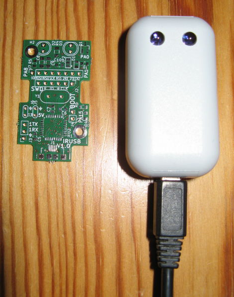
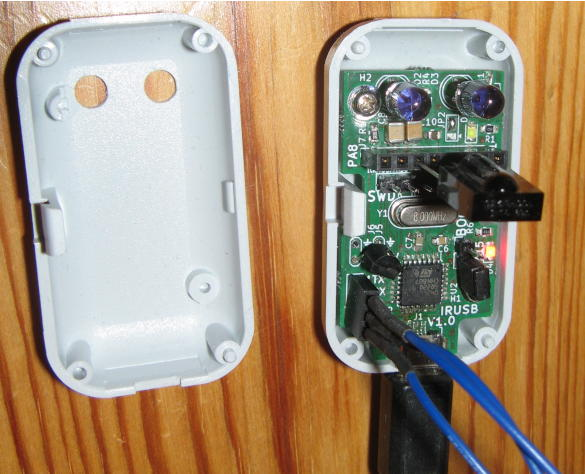

# IRUSB
This project is is a small board for sending infrared controller codes from a PC.
Receiving IR codes is possible too, but was not the main objective of this project.

## Host program

A host program for communicating is provided.
Written in python, it is platform independent - Linux and Windows were tested.

It all goes down to call the program like

./irusb-control.py 2 0xff00 0

Where the first parameter is the protocol, the second the address and the third the command.

You can add a TSOP31236 and call the host program without a parameter. Then press the key, you want to send later, on your existing infrared remote. The program then will print out the protocol, address and command discovered.

When installing the debian package, the same program can be called by the name irusb-control.

## Compiling and uploading

There is no additional programming hardware needed.

With apt install the packages gcc-arm-none-eabi, make, dfu-util and python3-usb.

Next, call make

Then close J4 and call ./dfu-upload.sh

Later, leave J4 open to directly start the flashed program.

## Debugging

You can add a serial port with 3.3V level to J3 and see some debug messages when using 19200baud.

Tested with a [NUCLEO-F411RE](https://www.st.com/en/evaluation-tools/nucleo-f411re.html), the software can be debugged. Open jumpers CN2 on the nucleo board and connect pins 2,3,4,5 of CN4 to the pins 2,3,4,5 of J2 on the IRUSB pcb.

## TODO

Create and publish a kicad symbol for a MCP1754-3302E_SOT23

Make a PCB layout version 1.1 with the fixed 3.3V regulator footprint

## Libraries used and licenses

The software uses several open source libraries with different licenses.

The HAL library from ST is published under the BSD 3-Clause license.

Some CMSIS header files are published under the Apache 2.0 license.

The [IRMP](https://www.mikrocontroller.net/articles/IRMP_-_english) project is published under GPL 2.0 or later.

[Libusb_stm32](https://github.com/dmitrystu/libusb_stm32) is published under the Apache 2.0 license.

Since GPL 2.0 and Apache 2.0 are considered [incompatible](https://www.apache.org/licenses/GPL-compatibility.html) by the Free Software Foundation, but GPL 3.0 is considered compatible, GPL 3.0 is the only possible license for the firmware on the microcontroller side.

The PCB is under creative common license. [CC-BY-SA 3.0 DE](https://creativecommons.org/licenses/by-sa/3.0/de/deed.en)

## Windows users

Windows makes using USB devices difficult :( These steps are tested with Windows 10 64bit version 1903.

Install [python 3.9 for windows](https://www.python.org/downloads/windows/) and allow adding python to PATH.

Start cmd

Install pyusb with pip3 install pyusb

Now calling irusb-control.py will result in the error message "No backed available."

You will need a windows driver for IRUSB.  (libusbK-inf-wizard.exe)[https://sourceforge.net/projects/libusb-win32/files/libusb-win32-releases/libusbK-inf-wizard.exe] can generate one. I tried kernel driver package libusb0 v1.2.6.0. Select IRUSB (VID = 0x7700), then in the generated DriverPackages directory call InstallDriver.exe.

Now calling irusb-control.py should work.
